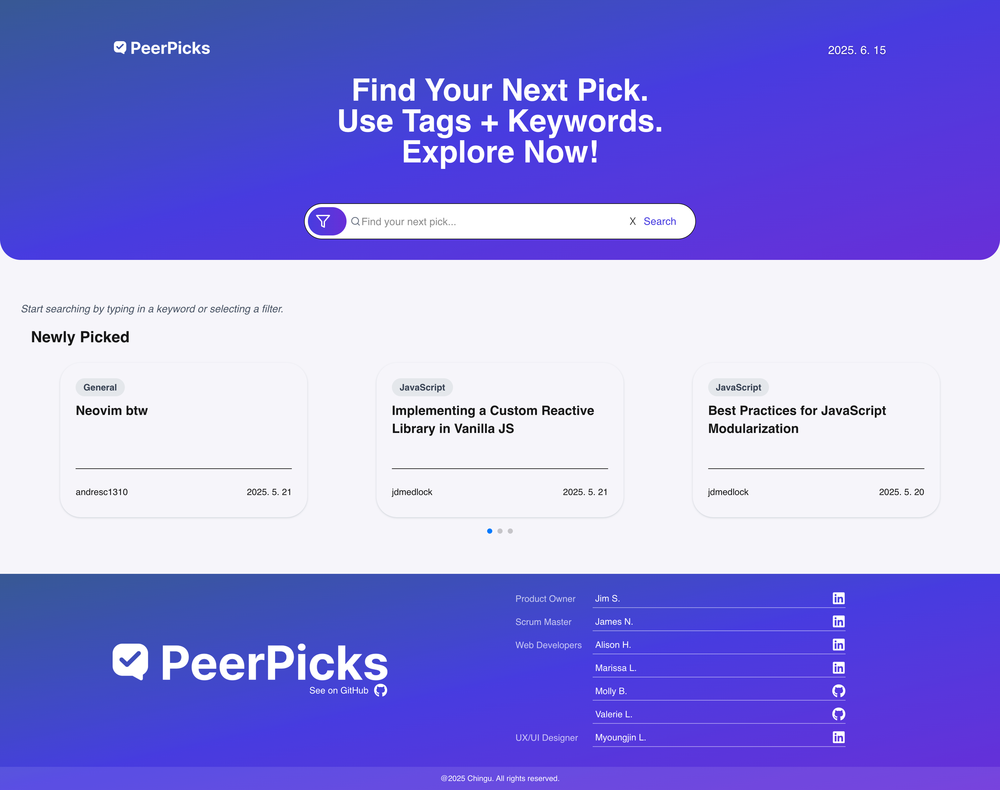
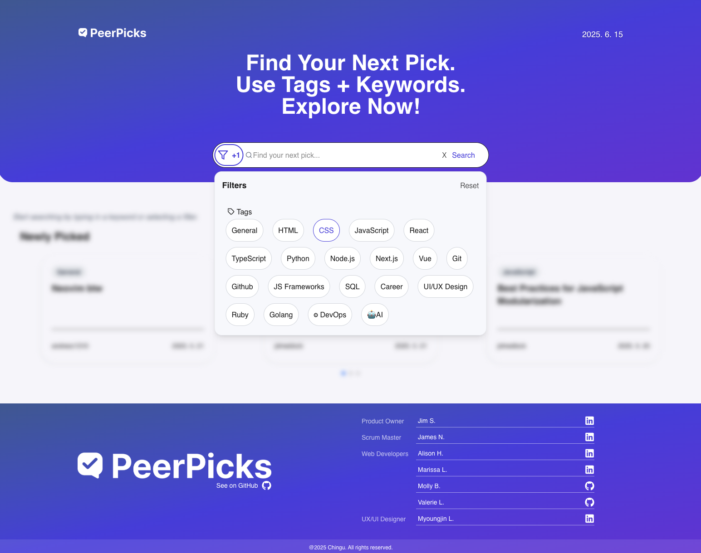
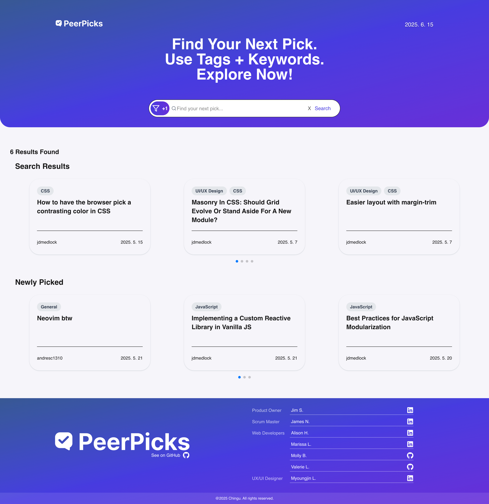
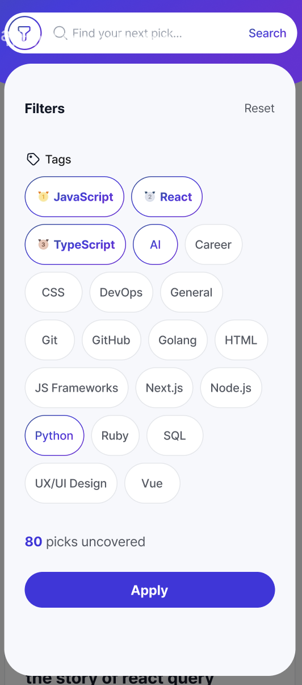
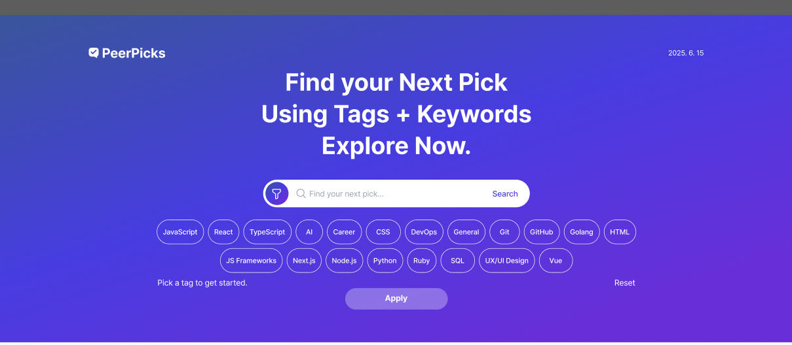

# PeerPicks

PeerPicks is a React app that helps users find resources to learn software development recommended by the Chingu Community.

This app was created through a [Chingu](https://www.chingu.io/) tier 2 voyage. As a team, we built a web application, PeerPicks, which lets its users find the information they need to reach their learning goals as software developers.

<div style="display: flex; flex-wrap: wrap; gap: 1rem; align-items: flex-start;">
  

  

  
</div>

## Features
### Search Form
- Input fields allow users to search for resources by tag name and words in the resource title.
- Submit button to initiate the search.
- Clicking the Clear button removes previous search results from the display.
- Users can update search fields between submissions without restriction.
- Users may enter any combination of fields — or leave them blank — to retrieve all resources.

### Search Results Area
- Upon submitting a search, the results area is dynamically updated with matching resources.
- Results are paginated (on larger screens) to handle large datasets.
- Users can navigate forward and backward through pages.

### Validation and Error Handling
- Displays loading message when connecting to the API or processing a search.
- Displays error messages when the API cannot load.

### Responsive Design
- The interface is fully responsive and works across various screen sizes.

## Future Development
There are enhancements to the filter functionality for both the mobile and desktop versions that we were designed but we were unable to complete in the allotted time.

<div style="display: flex; flex-wrap: wrap; gap: 1rem; align-items: flex-start;">
  <figure style="flex: 1 1 auto; margin: 0;">
    
  </figure>

  <figure style="flex: 1 1 auto; margin: 0;">
    
  </figure>
</div>

## Technologies
Frontend: 
- React + Next.js – For building a fast, interactive, and modern user interface
- Taiwind CSS - To build a clean, responsive UI quickly and consistently

API: 
- Railway - The API was provided by Chingu via Railway, with continuous updates communicated through Discord.

Deployment:
- Vercel – To host the frontend application.

UI Design:
- Figma – For designing and prototyping a cohesive user experience.


## Running the Project
### Live Version:
[PeerPicks](https://peerpicks.vercel.app/)

### From the Repo:
1. Clone this project locally
2. Run npm install in your bash / command line
3. Run npm run dev in your bash / command line

## Dependencies
```
"@reduxjs/toolkit": "^2.8.2",
"next": "15.3.2",
"pretendard": "^1.3.9",
"react": "^19.0.0",
"react-dom": "^19.0.0",
"react-icons": "^5.5.0",
"react-redux": "^9.2.0",
"swiper": "^11.2.6"
```
 
### Dev Dependencies
```
"@eslint/eslintrc": "^3",
"@tailwindcss/postcss": "^4",
"autoprefixer": "^10.4.21",
"eslint": "^9",
"eslint-config-next": "15.3.2",
"postcss": "^8.5.4",
"prettier": "^3.5.3",
"tailwindcss": "^4.1.8"
```

## Acknowledgements
We would like to extend our heartfelt thanks to Chingu for making this project possible. Their support, community, and structured project-based learning environment provided the perfect foundation for us to collaborate, grow, and build something we're truly proud of.

If you’re not yet a part of [Chingu](https://chingu.io/), we highly recommend checking it out. Chingu is a global learning community that helps aspiring developers, scrum masters, and product ownsers turn course and tutorial knowledge into real-world project experience. Through team voyages like this one, members gain the practical, hands-on skills that make them stand out in today’s job market.

## Our Team
- Myoungjin L., Designer: [GitHub](https://github.com/lmj5081) / [LinkedIn](https://www.linkedin.com/in/mjleedesigners)
- Marissa L., Developer: [GitHub](https://github.com/msrissaxox) / [LinkedIn](https://linkedin.com/in/marissalamothe/)
- Alison H., Developer: [GitHub](https://github.com/alison-ah) / [LinkedIn](https://linkedin.com/in/andersonholland/)
- Valerie L., Developer: [GitHub](https://github.com/val-ue) / [LinkedIn](https://www.linkedin.com/in/valerielabideveloper/)
- Molly B., Developer: [GitHub](https://github.com/learningcoding2022) / [LinkedIn](https://www.linkedin.com/in/molly-b-97877492/)
- Jim S., Product Owner: [GitHub](https://github.com/jaschibler) / [LinkedIn](https://linkedin.com/in/jimschibler)
- James N., Scrum Master: [GitHub](https://github.com/Nwumfor) / [LinkedIn](https://linkedin.com/in/james-nwumfor-56008144)
